list-comprehension-demos
========================

This repository contains some demos made possible by the addition of list comprehension to OpenSCAD.
In particular it contains a user-space sweep() module which can be used to sweep a 2D shape along a 3D path.

This is a fork of another repository and is aimed at a new version of sweep.scad. A demo of the new version is also included. 

To use these demos, first install the scad-utils library (https://github.com/openscad/scad-utils) in OpenSCAD's library path.

## [The new library sweep.scad](sweep.scad)

My work on this library was:

1. incorporate the minimum twist code Oskar Linde posted in the Openscad Forum (http://forum.openscad.org/Twisty-problem-with-scad-utils-quot-sweep-quot-tc9775.html)

2. polishing some functions (simplifying some, allowing tail-recursion elimination, etc)

3. include comments

4. add three helper functions to allow the control of sweep twists:

    - adjusted_rotations(path_transf, angini=0, angtot=0, closed=false)
    - adjusted_directions(path_transf, v0, vf=undef, turns=0, closed=false)
    - referenced_path_transforms(path, vref, closed)

5. include the possibility of the user computation of the path tangents

The last function is a substitute to the original
construct_transform_path(path, closed=false) .
It is useful to constraint the sweep rotations to keep the sections aligned
with a surface normal.

## [SweepDemo.scad](SweepDemo.scad)

It is a parametric demo that explores the functionality of the OpenSCAD Customizer version 2016.08.18, a snapshot version. Download also the SweepDemo.json and put it in the same directory and the Customizer will preload the cases illustrated below. Certainly it may be tried with other versions by editing the parameter values.

The specific output of the following images uses the referenced_path_transforms() function so the semicircular section keeps settled on the torus surface along all the path. The second image, besides the sweep, shows the sweep frame, that is the directions the x and y axis of the 2D section will be mapped to by the sweep at each path point.

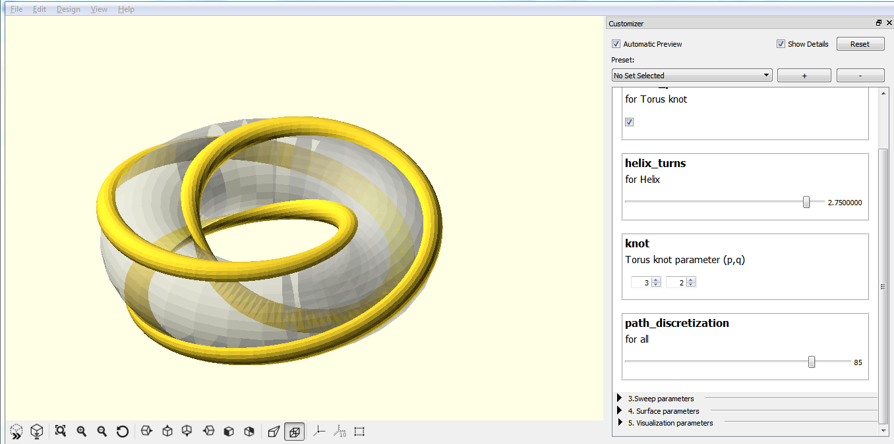

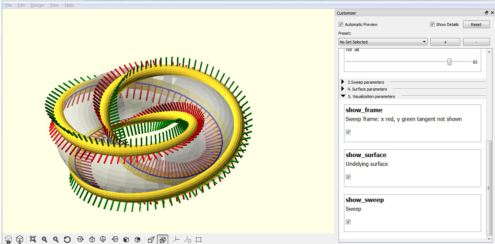

## [tubeDemo.scad](tubeDemo.scad)

A simple demonstration of how to use the function sweep_polyhedron() from sweep.scad to build a general tube with varying section shape.

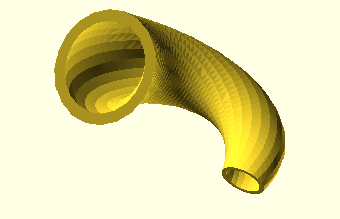

## [extrusion.scad](extrusion.scad)

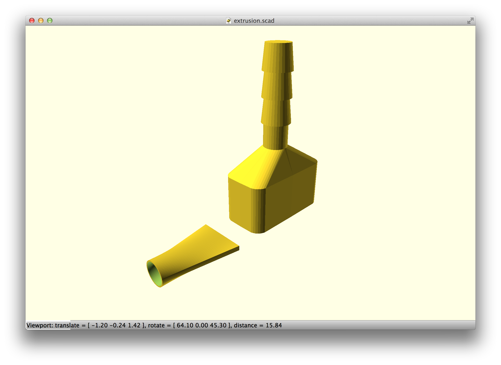

## [forma-candle-holder.scad](forma-candle-holder.scad)

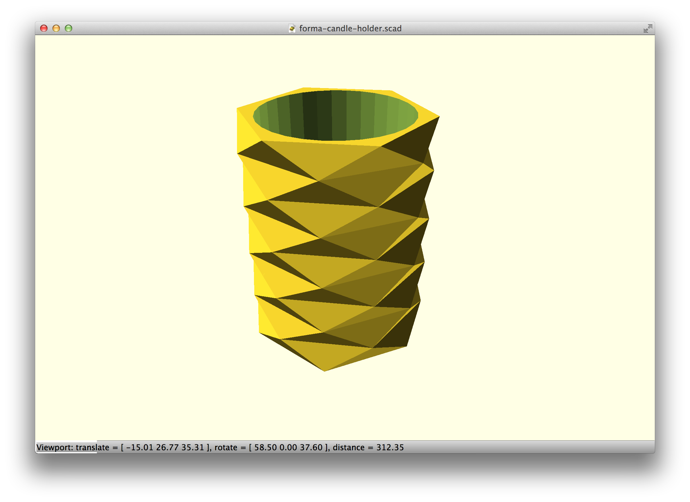

## [superformula.scad](superformula.scad)

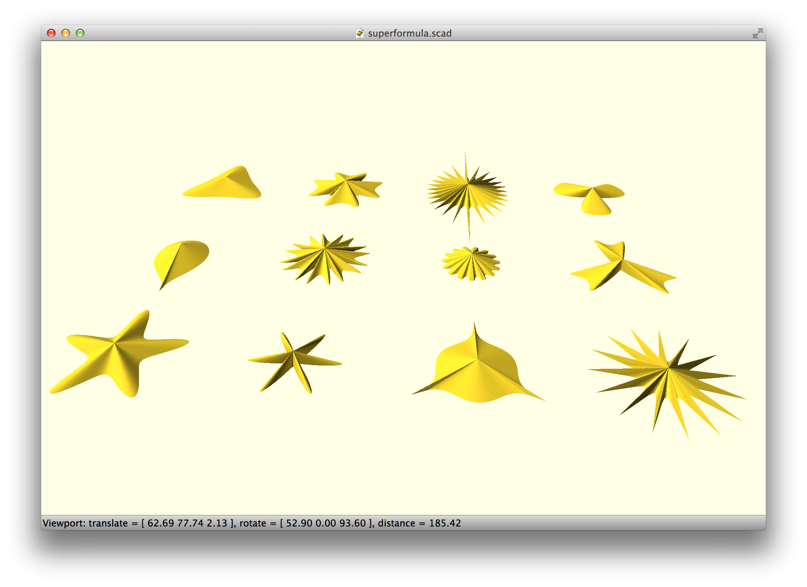

## [sweep-drop.scad](sweep-drop.scad)

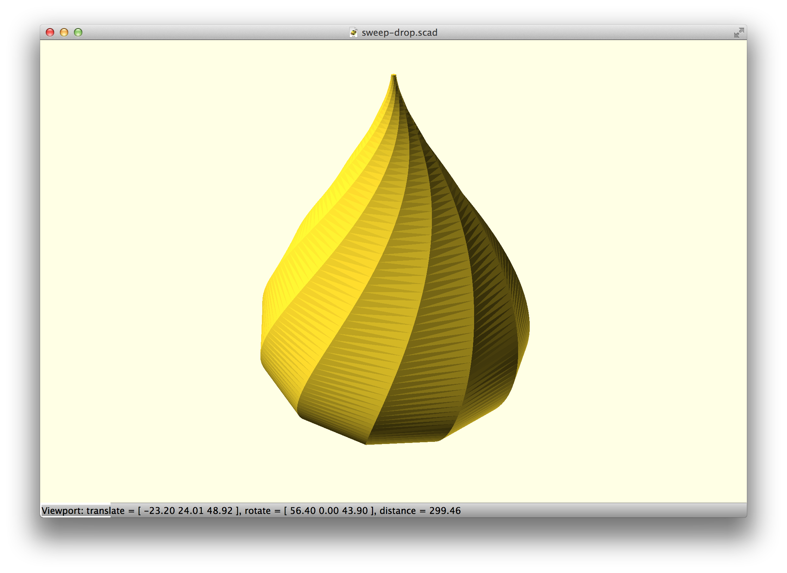

## [sweep-path.scad](sweep-path.scad)

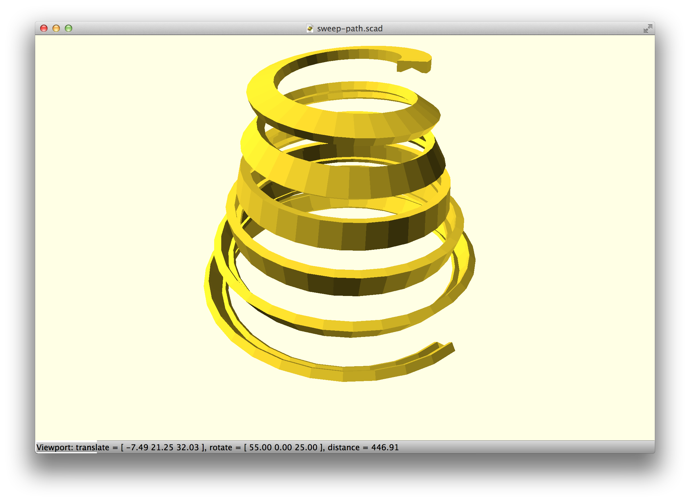

## [sweep-test.scad](sweep-test.scad)

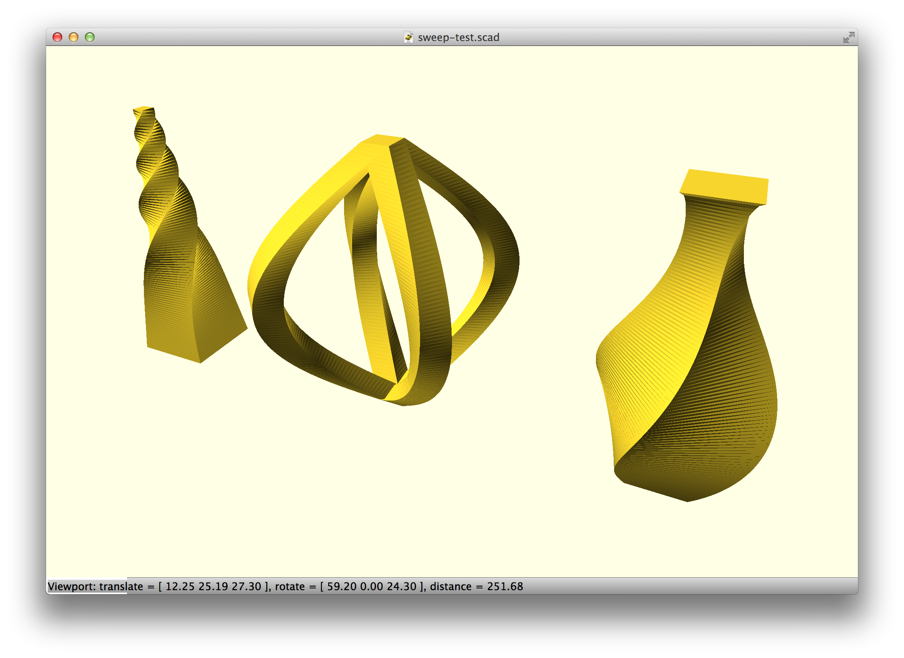

## [toothed-belt.scad](toothed-belt.scad)

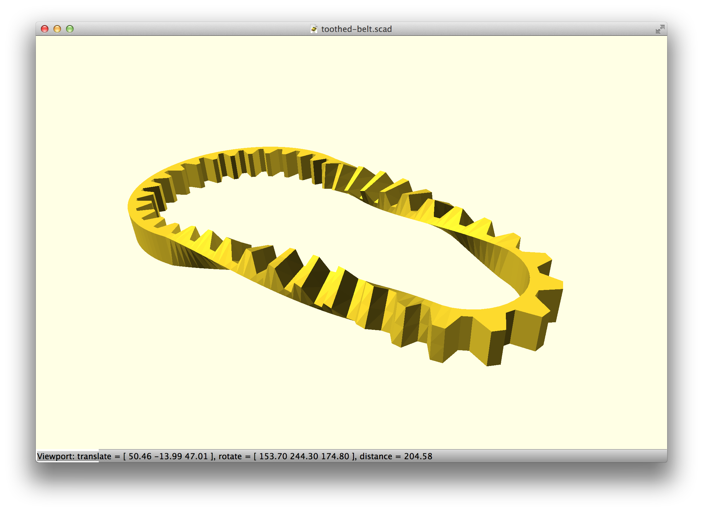

## [trefoil-knot-sweep.scad](trefoil-knot-sweep.scad)

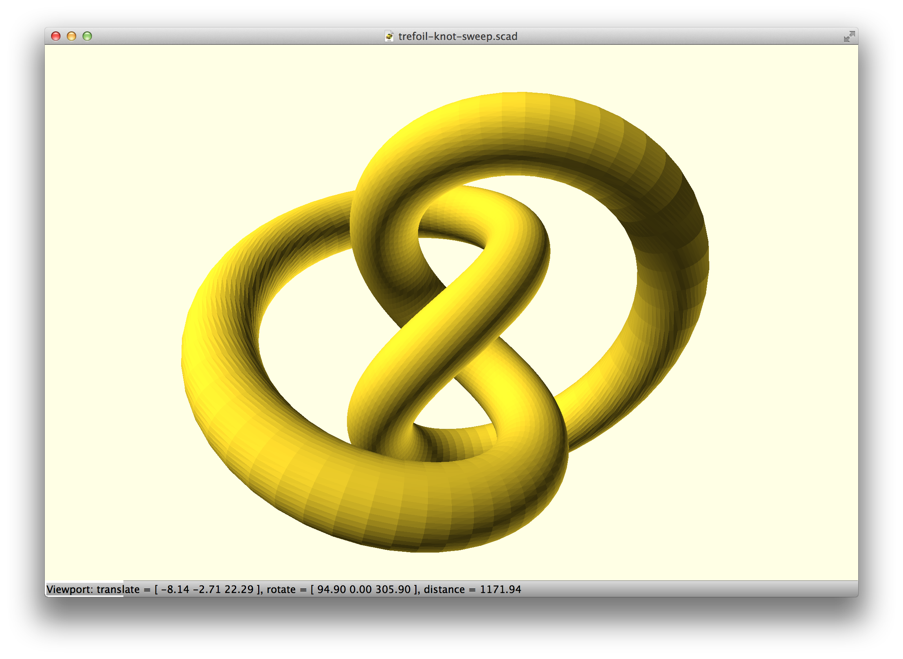

## [wave-cylinder.scad](wave-cylinder.scad)

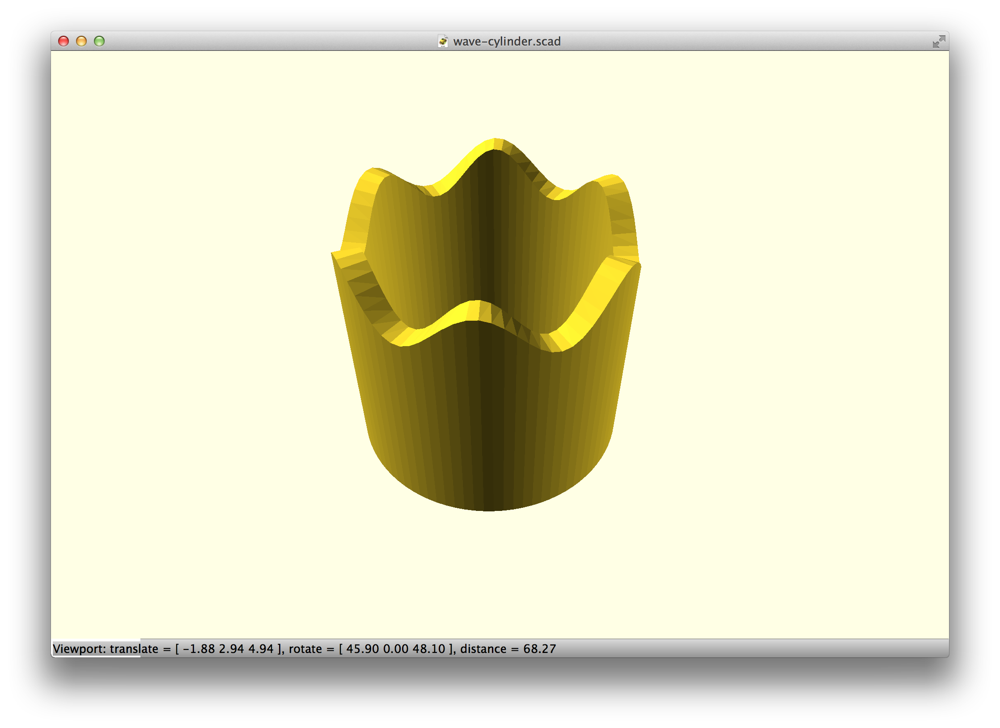

## [3d-function.scad](3d-function.scad)

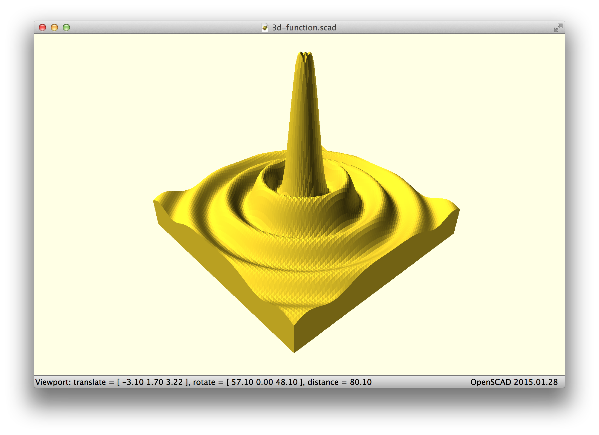

## [spiral-2d.scad](spiral-2d.scad)

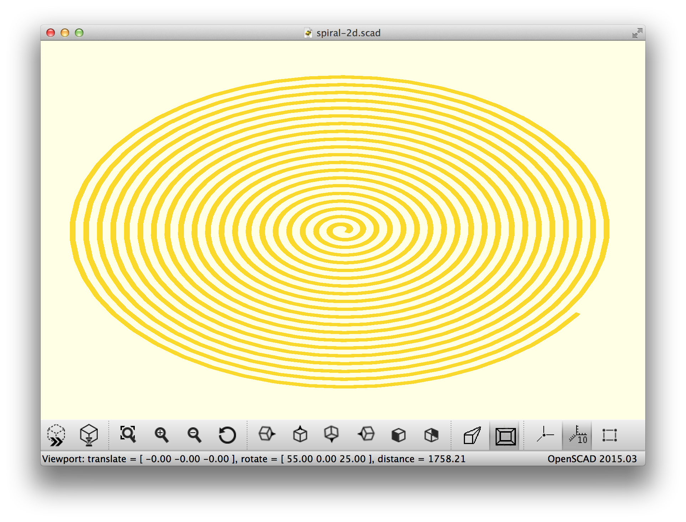
